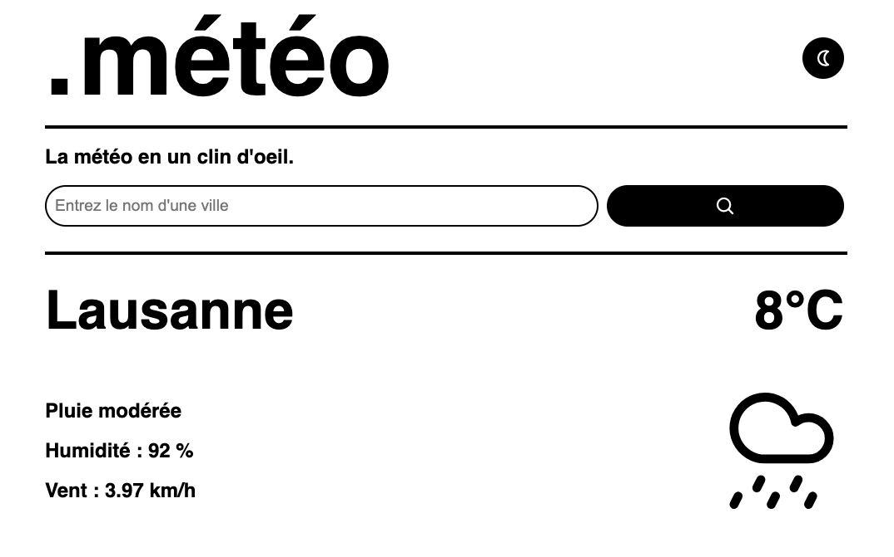
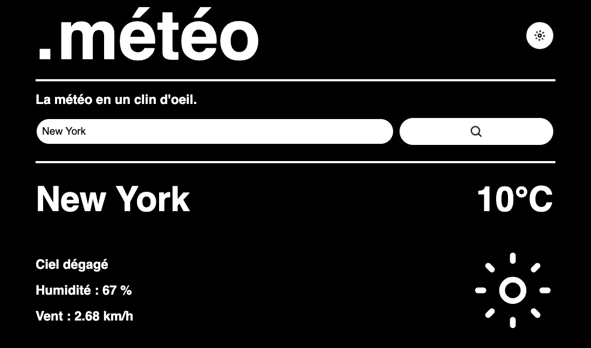

# .météo - A Simple Weather App

.météo is a simple web application that allows you to check the weather of any city quickly and easily.

When launched, the app will automatically give you the weather based on your device's location.

Made with pure HTML, CSS and JavaScript.

## Preview

## Access the app

Open the app [here](https://erzloh.github.io/.meteo/)!

## Credits

- Weather information is provided by the [OpenWeatherMap API](https://openweathermap.org/).
- the iconset is from [Streamline Icons](https://streamlineicons.com/).
- the font used is Helvetica.